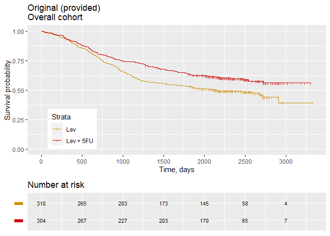
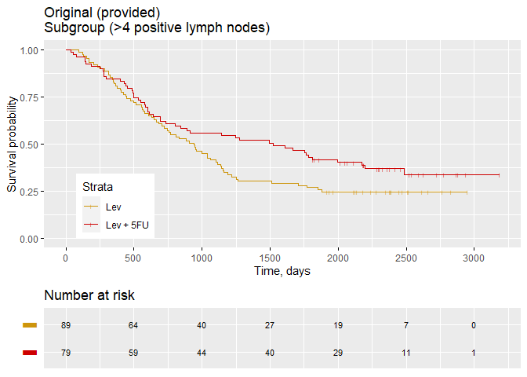
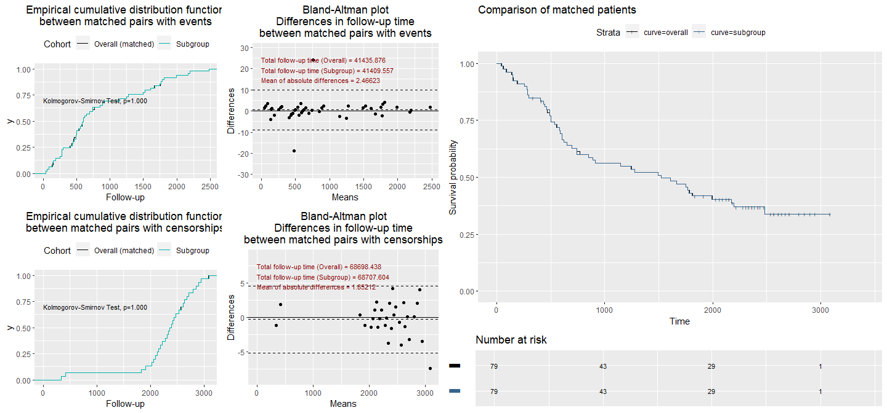
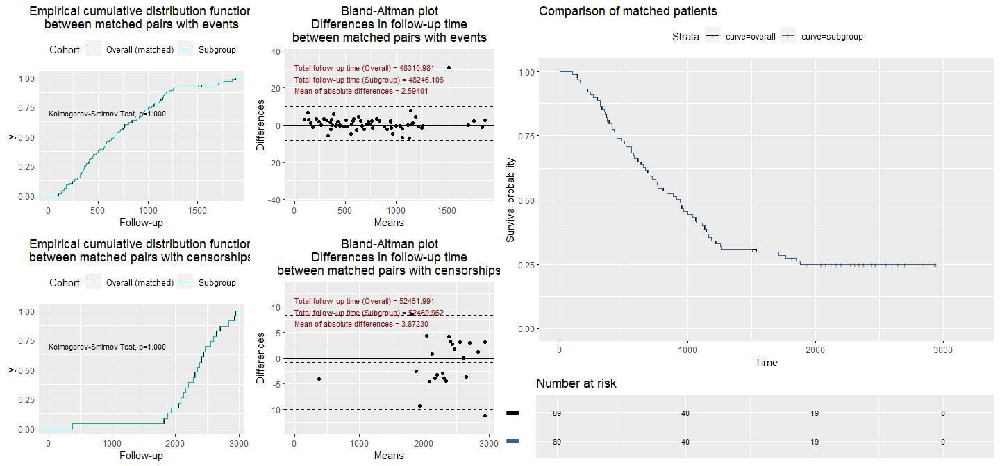
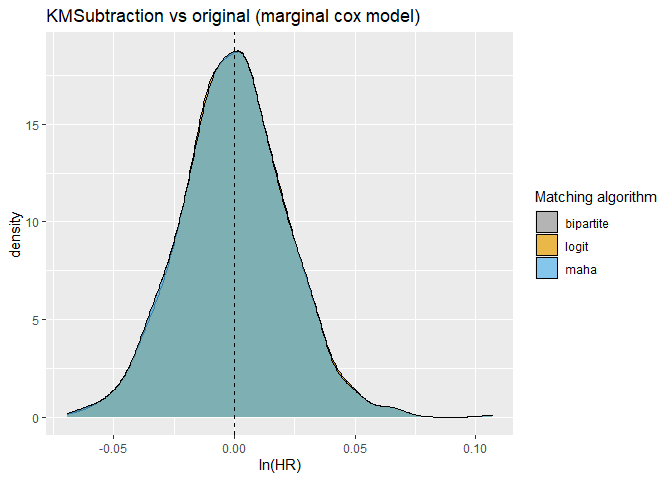
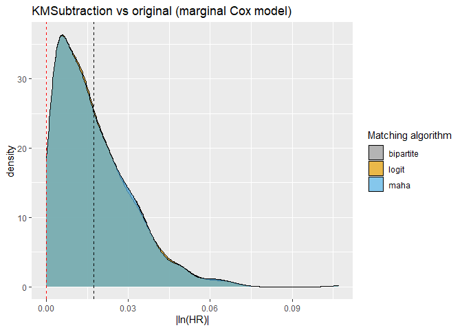
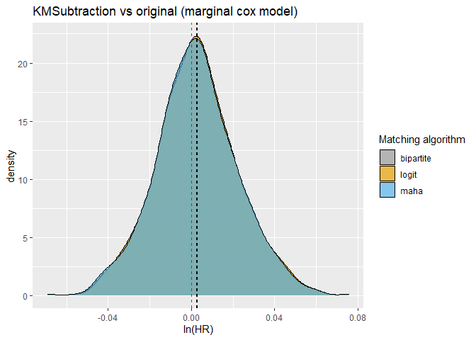
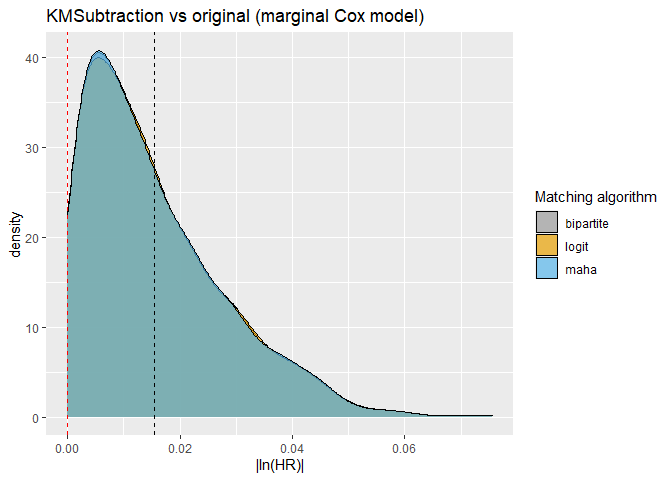
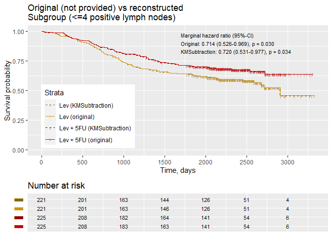

*Joseph J Zhao*

In this vignette, we demonstrate `KMSubtraction`, an approach to
retrieve unreported subgroup survival data from published Kaplan-Meier
survival curves (`KMSubtractionMatch()`). We also discuss methods to
evaluate the limits of error (`KMSubtractionError()`) and quality of
match (`KMSubtractionEvaluateMatch()`).

## **Installation**

``` r
library(devtools)
install_github("josephjzhao/KMSubtraction")
library(KMSubtraction)
```

## **Scenario**

For this example, we may use the colon dataset from the survival package
in R (R Core Team 2021; Therneau 2021).

``` r
data(cancer, package="survival")
```

### **Create curves for the scenario**

For this example, we will be using the colon dataset from the survival
package. We will assume the scenario in which, Kaplan-Meier (KM) curves
of treatment outcomes with systemic therapy (5FU+Lev vs Lev) is only
presented for patients in the overall cohort and patients with more than
4 positive lymph nodes (the subgroup).

As such, KM curves for patients with less than 4 positive lymph nodes is
unavailable.

If you already have reconstructed curves, please skip to the
implementation of `KMSubtractionMatch()` below.

``` r
df_overall=subset(colon, !colon$rx=="Obs" & colon$etype==2)
df_subgroup=subset(colon, colon$node4==1 & !colon$rx=="Obs" & colon$etype==2)

km_overall=survfit(Surv(time, status) ~ rx, data=df_overall)
km_subgroup=survfit(Surv(time, status) ~ rx, data=df_subgroup)

# Curves, as shown in this hypothetical publication
ggsurvplot(km_overall,                    
          data = df_overall,  
          size=0.5,
          risk.table = TRUE,    
          censor.shape="|",
          censor.size = 1.2,
          conf.int = F, 
          xlim = c(0,max(df_overall$time)),
          xlab = "Time, days",  
          break.time.by = 500, 
          legend=c(0.15,0.2),
          ggtheme = theme(),
          risk.table.fontsize=3,
          risk.table.y.text = F,
          palette=c("darkgoldenrod3", "red3"),
          legend.labs=c("Lev", "Lev + 5FU"),
          tables.theme = theme_cleantable(),
          title="Original (provided)\nOverall cohort")
```



``` r
ggsurvplot(km_subgroup,                    
          data = df_subgroup,  
          size=0.5,
          risk.table = TRUE,    
          censor.shape="|",
          censor.size = 1.2,
          conf.int = F, 
          xlim = c(0,max(df_subgroup$time)),
          xlab = "Time, days",  
          break.time.by = 500, 
          legend=c(0.15,0.2),
          ggtheme = theme(),
          risk.table.fontsize=3,
          tables.theme = theme_cleantable(),
          risk.table.y.text = F,
          legend.labs=c("Lev", "Lev + 5FU"),
          palette=c("darkgoldenrod3", "red3"),
          title="Original (provided)\nSubgroup (>4 positive lymph nodes)")
```



### **Retrieve xy coordinates of the upstream 4 curves**

We will use the `getxycoordinates()` function from the `KMSubtraction`
package to retrieve the xy coordinates for each curve.

``` r
df_overall_arm1=subset(df_overall, df_overall$rx=="Lev+5FU")
df_overall_arm2=subset(df_overall, df_overall$rx=="Lev")
df_subgroup_arm1=subset(df_subgroup, df_subgroup$rx=="Lev+5FU")
df_subgroup_arm2=subset(df_subgroup, df_subgroup$rx=="Lev")

l=list(df_overall_arm1, df_overall_arm2, df_subgroup_arm1, df_subgroup_arm2)
xy=lapply(l, getxycoordinates)
```

### **`IPDfromKM`**

Using the `IPDfromKM` package, we will reconstruct each curve (Liu and
Lee 2020).

``` r
recon=list()

for (i in 1:length(l)){
  ipd=getIPD(prep=preprocess(dat=xy[[i]], 
                      trisk=ggsurvtable(survfit(Surv(time, status) ~ 1, data=l[[i]]), data=l[[i]], break.time.by = 250)$risk.table$data$time, 
                      nrisk=ggsurvtable(survfit(Surv(time, status) ~ 1, data=l[[i]]), data=l[[i]], break.time.by = 250)$risk.table$data$n.risk, 
                      maxy=1),
                      armID=1, tot.events=NULL)$IPD
  recon[[i]]=ipd
}
```

## **Implementation of `KMSubtraction`**

### **`KMSubtractionMatch`**

Conduct minimum cost bipartite matching through the Hungarian algorithm
with the `RcppHungarian` package in R (Silverman 2019). Patients with
events and censorships will be matched separately.

``` r
match_arm1=KMSubtractionMatch(recon[[1]], recon[[3]], matching="bipartite")
match_arm2=KMSubtractionMatch(recon[[2]], recon[[4]], matching="bipartite")
```

### **`KMSubtractionEvaluateMatch`**

We may now evaluate the quality of matching by comparing patients in the
cohort with \>4 positive lymph nodes, and the matched patients from the
overall cohort. We will use the `KMSubtractionEvaluateMatch()` function.
We will do so by inspecting Empirical cumulative distribution functions
and the Kolmogorov−Smirnov Test of follow-up times between matched pairs
as well as with Bland-Altman plots to explore discrepancies between
matched pairs.

``` r
KMSubtractionEvaluateMatch(match_arm1$data)
```

    ## $`Evaluate match among patients with events`
    ##                                            
    ## Kolmogorov-Smirnov Test, p          1.00000
    ## Total follow-up time (Overall)  41435.87600
    ## Total follow-up time (Subgroup) 41409.55700
    ## Mean of absolute differences        2.46623
    ## 
    ## $`Evaluate match among patients with censorships`
    ##                                            
    ## Kolmogorov-Smirnov Test, p          1.00000
    ## Total follow-up time (Overall)  68698.43800
    ## Total follow-up time (Subgroup) 68707.60400
    ## Mean of absolute differences        1.85212
    ## 
    ## $plot



    ## 
    ## attr(,"class")
    ## [1] "KMSubtractionEvaluateMatch"

``` r
KMSubtractionEvaluateMatch(match_arm2$data)
```

    ## $`Evaluate match among patients with events`
    ##                                            
    ## Kolmogorov-Smirnov Test, p          1.00000
    ## Total follow-up time (Overall)  48310.98100
    ## Total follow-up time (Subgroup) 48246.10600
    ## Mean of absolute differences        2.59401
    ## 
    ## $`Evaluate match among patients with censorships`
    ##                                           
    ## Kolmogorov-Smirnov Test, p          1.0000
    ## Total follow-up time (Overall)  52451.9910
    ## Total follow-up time (Subgroup) 52469.9620
    ## Mean of absolute differences        3.8723
    ## 
    ## $plot



    ## 
    ## attr(,"class")
    ## [1] "KMSubtractionEvaluateMatch"

It may also be useful to understand the uncertainty surrounding each
task. We may do so using the function `KMSubtractionError()`, which
conducts Monte Carlo simulations to evaluate the limits of error of
`KMSubtractionMatch()` given parameters surrounding the task at hand.
For each iteration, reconstructed and original survival data may be
compared by means of marginal Cox-proportional hazard models and
restricted mean survival time difference (RMST-D). This may be
especially relevant in situations where there is missing data in the
opposing subgroup. The association of each parameter on the limits of
error is further discussed in our validation study.

As an example, we may assume that 2% of patients from the overall cohort
do not have lymph node status. This 2% of patients, which would not be
represented in the \>4 positive lymph node subgroup, would be inevitably
and erroneously be in the unreported opposing subgroup.

``` r
error_arm1=KMSubtractionError(n=match_arm1$Parameters[1,1],
                      mc=1000,
                      censor_overall.p=match_arm1$Parameters[4,1],
                      censor_subgroup.p=match_arm1$Parameters[5,1],
                      subgroup.p=match_arm1$Parameters[3,1],
                      missing.p=0.02,
                      ncores=round(detectCores()*0.5))

error_arm2=KMSubtractionError(n=match_arm2$Parameters[1,1],
                      mc=1000,
                      censor_overall.p=match_arm2$Parameters[4,1],
                      censor_subgroup.p=match_arm2$Parameters[5,1],
                      subgroup.p=match_arm2$Parameters[3,1],
                      missing.p=0.02,
                      ncores=round(detectCores()*0.5))
```

From the following density plots and summary statistics, we may infer
that given the parameters surrounding the current KMSubtraction task,
the limits of error between reconstructed and original data is small and
largely negligible.

``` r
error_arm1$table.cox
```

    ##    Matching  ln(HR), mean ln(HR), sd |ln(HR)|, mean |ln(HR)|, sd
    ## 1 bipartite -2.670765e-05 0.02200579     0.01724198   0.01366280
    ## 2      maha -1.297061e-04 0.02203439     0.01725930   0.01368758
    ## 3     logit  1.118309e-04 0.02192979     0.01719347   0.01360209

``` r
error_arm2$table.cox
```

    ##    Matching ln(HR), mean ln(HR), sd |ln(HR)|, mean |ln(HR)|, sd
    ## 1 bipartite  0.002717454 0.01959904     0.01537583   0.01244434
    ## 2      maha  0.002562037 0.01964567     0.01540533   0.01244834
    ## 3     logit  0.002771905 0.01960459     0.01539186   0.01244527

``` r
error_arm1$density.cox # Outcomes of Monte Carlo simulations for Lev+5FU
```



``` r
error_arm1$density.abscox
```



``` r
error_arm2$density.cox # Outcomes of Monte Carlo simulations for Lev
```



``` r
error_arm2$density.abscox
```



Finally, we may retrieve the unmatched patients, which may be assumed to
be from the unreported cohort - patients with less than 4 positive lymph
nodes. We may compare it to the original patients from the colon
dataset.

``` r
# Retrieve the unmatched patients
match_arm1$data_unreportedsubgroup$rx="Lev+5FU"
match_arm2$data_unreportedsubgroup$rx="Lev"
df_kmsubtraction=bind_rows(match_arm1$data_unreportedsubgroup, match_arm2$data_unreportedsubgroup)

# Compute hazard ratios from a marginal cox model
colon$rx=colon$rx %>% as.character
sum.cox_kmsubtraction=coxph(Surv(time, status) ~ rx, data=df_kmsubtraction) %>% summary
sum.cox_original=coxph(Surv(time, status) ~ rx, data=subset(colon, !colon$rx=="Obs" & colon$node4==0 & colon$etype==2)) %>% summary

df_original_sub=subset(colon, !colon$rx=="Obs" & colon$node4==0 & colon$etype==2) %>% select("time", "status", "rx")
df_original_sub$rx=paste0(df_original_sub$rx, " (original)")
df_kmsubtraction$rx=paste0(df_kmsubtraction$rx, " (KMSubtraction)")
df_combined=bind_rows(df_original_sub, df_kmsubtraction)

km_combined=survfit(Surv(time, status) ~ rx, data=df_combined)

plot_km_combined=ggsurvplot(km_combined,                    
                  data = df_combined,  
                  size=0.5,
                  risk.table = TRUE,    
                  censor.shape="|",
                  censor.size = 1.2,
                  conf.int = F, 
                  xlim = c(0,max(df_combined$time)),
                  xlab = "Time, days",  
                  break.time.by = 500, 
                  ggtheme = theme(),
                  palette=c("darkgoldenrod4", "darkgoldenrod3", "red4", "red3"),
                  linetype = c(2,1,2,1),
                  legend.labs=c("Lev (KMSubtraction)", "Lev (original)", "Lev + 5FU (KMSubtraction)", "Lev + 5FU (original)"),
                  risk.table.y.text = F,
                  risk.table.fontsize=3,
                  legend=c(0.2,0.3),
                  tables.theme = theme_cleantable(),
                  title="Original (not provided) vs reconstructed\nSubgroup (<=4 positive lymph nodes)")

plot_km_combined$plot=plot_km_combined$plot+ggplot2::annotate("text", hjust = 0,
                                                      x = 1700, y = 0.9,
                                                      label = paste0("Marginal hazard ratio (95%-CI)\n",
                                                                    "Original",
                                                                     ": ",
                                                                     paste0(format(round(sum.cox_original$conf.int[1,1],3), nsmall=3), " (", format(round(sum.cox_original$conf.int[1,3],3), nsmall=3), "-", format(round(sum.cox_original$conf.int[1,4],3), nsmall=3), ")"),
                                                                     ", ",ifelse(sum.cox_original$sctest[3]<0.001, paste("p < 0.001"), paste("p = ", format(round(sum.cox_original$sctest[3],3), nsmall=3),sep="")),
                                                                     "\nKMSubtraction",
                                                                     ": ",
                                                                     paste0(format(round(sum.cox_kmsubtraction$conf.int[1,1],3), nsmall=3), " (", format(round(sum.cox_kmsubtraction$conf.int[1,3],3), nsmall=3), "-", format(round(sum.cox_kmsubtraction$conf.int[1,4],3), nsmall=3), ")"),
                                                                     ", ",ifelse(sum.cox_kmsubtraction$sctest[3]<0.001, paste("p < 0.001"), paste("p = ", format(round(sum.cox_kmsubtraction$sctest[3],3), nsmall=3),sep=""))
                                                                     
                                                                     ), size = 3)

plot_km_combined
```



Acknowldegements: The authors would like to thank Assistant Professor
Justin Silverman, College of Information Science and Technology, Penn
State University, USA, for clarifying enquiries regarding the use of the
Hungarian algorithm for bipartite matching.

### **References**

<div id="refs" class="references csl-bib-body hanging-indent">

<div id="ref-R-IPDfromKM" class="csl-entry">

Liu, Na, and J.Jack Lee. 2020. *IPDfromKM: Map Digitized Survival Curves
Back to Individual Patient Data*.
<https://CRAN.R-project.org/package=IPDfromKM>.

</div>

<div id="ref-R-base" class="csl-entry">

R Core Team. 2021. *R: A Language and Environment for Statistical
Computing*. Vienna, Austria: R Foundation for Statistical Computing.
<https://www.R-project.org/>.

</div>

<div id="ref-R-RcppHungarian" class="csl-entry">

Silverman, Justin. 2019. *RcppHungarian: Solves Minimum Cost Bipartite
Matching Problems*. <https://github.com/jsilve24/RcppHungarian>.

</div>

<div id="ref-R-survival" class="csl-entry">

Therneau, Terry M. 2021. *Survival: Survival Analysis*.
<https://github.com/therneau/survival>.

</div>

</div>
